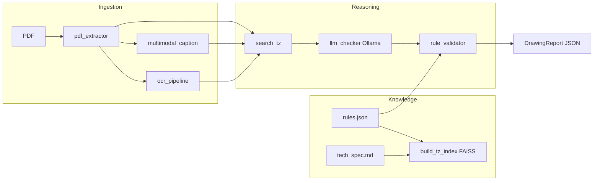
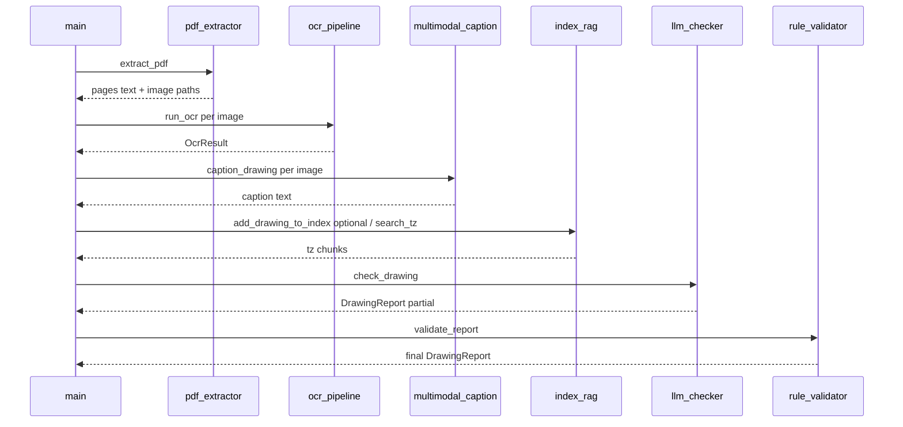

# Drawing–Spec Compliance Analyzer

Local, offline-capable pipeline that ingests technical PDFs (single sheets, multi-page albums, or house-project albums), fuses **vector text**, **OCR**, and **vision captions**, retrieves **specification chunks via embedding search**, and produces **structured compliance reports** grounded in `docs/tech_spec.md` and deterministic checks in `config/rules.json`. Designed for **QC-style review of drawings against a written technical specification (ТЗ)**, with explicit handling of “cannot determine” outcomes when evidence is missing.

**This repository is a CLI toolkit, not a hosted web service.** There are no HTTP routes in the codebase; integration is via `main.py` and `python -m scripts.*` entry points.

---

## Features

| Area | What the code actually does |
|------|----------------------------|
| **PDF ingestion** | PyMuPDF renders pages to PNG (300 dpi), extracts text; optional `pymupdf4llm` markdown-style text per page (`scripts/pdf_extractor.py`). |
| **OCR** | Tesseract (`rus+eng`, PSM 6) first; if meaningful character count is low, **EasyOCR** is tried; best result wins (`scripts/ocr_pipeline.py`). |
| **Vision understanding** | Page images sent to **Ollama** with a multimodal model (default `llava`) for a conservative Russian caption—only visible content (`scripts/multimodal_caption.py`). |
| **RAG over ТЗ** | `docs/tech_spec.md` + a text projection of `config/rules.json` are chunked, embedded with **sentence-transformers** (`paraphrase-multilingual-MiniLM-L12-v2`), stored in **FAISS** (`IndexFlatIP`, cosine via normalized vectors). Top-*k* chunks feed the text LLM (`scripts/index_rag.py`). |
| **LLM reasoning** | **Ollama** `/api/generate` with `format: json`, low temperature; prompt restricts claims to drawing text + retrieved ТЗ chunks (`scripts/llm_checker.py`). |
| **Deterministic validation** | After the LLM (or without it), `rule_validator.py` recomputes compliance from numeric ranges, allowed lists, regex designations, forbidden materials—**no model in this layer**. |
| **Heuristic fallback** | If the text model is unavailable or returns no elements, regex-style extraction from raw text using `rules.json` (`scripts/heuristic_extract.py`). |
| **Album workflows** | **`--pipeline-album`**: split multi-house PDFs by project signatures (`scripts/pdf_project_splitter.py`, OCR-aware), then run full analysis per split PDF. **`--split-output-dir`**: alternative splitting via page classification (`scripts/pdf_cutter.py`, `utils/pdf_analyzer.py`). |
| **Batch-by-page** | **`--all-pages`**: each page is a separate logical drawing id `{base}-стр.N` with aggregate `compliant` / `non_compliant` / `undetermined` lists (`PdfBatchReport` in `scripts/models.py`). |
| **Diagnostics** | `--check-ollama` and `scripts/ollama_util.py` probe reachability and installed models (with Windows-friendly `127.0.0.1` vs `localhost` fallback). |

---

## System workflow

Typical path for a single drawing PDF:

```text
PDF file
  → extract pages (text + PNG)                    [pdf_extractor]
  → optional: OCR per page image                   [ocr_pipeline: tesseract → easyocr fallback]
  → optional: LLaVA caption per page             [multimodal_caption → Ollama]
  → fuse: PDF text + OCR blocks + captions        [main._process_one_sheet]
  → embed query prefix → FAISS search ТЗ           [index_rag.search_tz]
  → text LLM JSON (elements + compliance draft)    [llm_checker.check_drawing → Ollama]
  → merge / heuristic fill if empty elements      [heuristic_extract + main._finalize_report]
  → deterministic rules pass                      [rule_validator.validate_report]
  → DrawingReport JSON + console summary          [main.analyze_drawing]
```

Album pipeline (`--pipeline-album`):

```text
Album PDF
  → detect project boundaries (text + optional Tesseract on weak pages)   [pdf_project_splitter]
  → write one PDF per project under --projects-dir
  → for each PDF: same pipeline as single-drawing
  → aggregate JSON: compliant / non_compliant / undetermined + per-project reports   [run_album_pipeline]
```

---

## Architecture

The design separates **evidence acquisition** (PDF/OCR/vision), **retrieval** (FAISS over spec), **interpretation** (LLM with constrained context), and **auditable enforcement** (rules file). The LLM never sees the full specification—only top-*k* retrieved chunks—reducing unchecked extrapolation into requirements not present in your ТЗ corpus.



**Sequence (one sheet):**



**Drawings index:** `add_drawing_to_index` appends embedded chunks of fused text for similarity search across processed drawings (metadata in `data/faiss_index/drawings_metadata.json`). ТЗ retrieval uses `tz_index.faiss` + `tz_metadata.json`.

---

## Tech stack

- **Language:** Python 3 (type hints, `pydantic` v2 models).
- **PDF:** PyMuPDF (`fitz`), optional `pymupdf4llm`.
- **OCR:** `pytesseract` + Tesseract engine; `easyocr`; `pdf2image` / Pillow where applicable; album splitter uses `pytesseract` on rendered strips.
- **Embeddings / vector search:** `sentence-transformers`, `faiss-cpu`, `numpy`.
- **LLM / VLM:** Ollama HTTP API (`requests`) — default text model `mistral`, vision `llava` (configurable flags).
- **Testing:** `pytest`, `pytest-mock`.
- **CLI:** `argparse` in `main.py` and script `__main__` blocks.

No database, message queue, or container definitions are present in this repository.

---

## Project structure

| Path | Role |
|------|------|
| `main.py` | Primary CLI: single PDF, `--all-pages` batch, `--pipeline-album`, `--split-output-dir`, Ollama diagnostics. |
| `scripts/pdf_extractor.py` | Page rasterization + text extraction + per-page JSON sidecars. |
| `scripts/ocr_pipeline.py` | Tesseract-first OCR with EasyOCR fallback. |
| `scripts/multimodal_caption.py` | Base64 image → Ollama multimodal generate. |
| `scripts/index_rag.py` | Chunking, ТЗ index build/search, incremental drawings index. |
| `scripts/llm_checker.py` | Prompt assembly, JSON-mode generation, parse to `DrawingReport`. |
| `scripts/rule_validator.py` | Loads `rules.json`; emits `ValidationIssue`s; reconciles `is_compliant`. |
| `scripts/heuristic_extract.py` | Pattern-based `DrawingElement` list when LLM is off or empty. |
| `scripts/pdf_project_splitter.py` | Regex/OCR-aided segmentation of multi-project house albums. |
| `scripts/pdf_cutter.py` | Alternative album splitting using `utils/pdf_analyzer` classifications. |
| `scripts/models.py` | Pydantic schemas: `DrawingReport`, `PdfBatchReport`, `ComplianceReport`, etc. |
| `scripts/ollama_util.py` | `OLLAMA_BASE_URL`, reachability, model presence. |
| `utils/pdf_analyzer.py` | Page feature extraction and heuristic classification (drawing vs junk vs exposition). |
| `config/rules.json` | Machine-readable tolerances, materials, coatings, designation regex. |
| `docs/tech_spec.md` | Human ТЗ source for RAG (replace with your project spec). |
| `tests/` | Unit tests for extractor, validator, cutter, analyzer, compliance normalization. |
| `data/` | Default output locations for images, extracted text, FAISS files, pipeline runs (see `.gitignore`). |

---

## Interface reference (CLI)

There is **no REST or GraphQL API**. The public contract is **CLI flags** and **JSON artifacts** on disk.

### `main.py`

| Mode | Invocation | Purpose |
|------|------------|---------|
| Single document | `python main.py --pdf PATH --drawing-id ID` | One logical drawing; all pages fused. |
| Per-page batch | `python main.py --pdf PATH --drawing-id PREFIX --all-pages` | Writes `*_batch_report.json` with `PdfBatchReport` shape. |
| Album pipeline | `python main.py --pipeline-album --pdf ALBUM --projects-dir DIR` | Split + analyze each project; aggregated pipeline JSON. |
| Split only | `python main.py --pdf ALBUM --split-output-dir DIR` | Uses `pdf_cutter.extract_drawings`; optional `--validate-split`. |
| Ollama check | `python main.py --check-ollama` | Prints connectivity and model list. |

**Common flags:** `--output`, `--model`, `--vision-model`, `--top-k`, `--skip-ocr`, `--skip-caption`, `--rebuild-tz`, `--rules`, `--spec`, `--ollama-base-url`, `-v`. Pipeline-only: `--pipeline-report`, `--split-no-ocr`, `--debug-split-signatures`.

### Module CLIs (`python -m scripts.<name>`)

| Module | Example | Purpose |
|--------|---------|---------|
| `scripts.index_rag` | `python -m scripts.index_rag --build-tz` | Build / refresh ТЗ FAISS index. |
| `scripts.index_rag` | `python -m scripts.index_rag --search "толщина стенки"` | Debug semantic search. |
| `scripts.pdf_extractor` | `python -m scripts.pdf_extractor --pdf X --id Y` | Extraction only. |
| `scripts.ocr_pipeline` | `python -m scripts.ocr_pipeline --image path.png` | OCR only. |
| `scripts.multimodal_caption` | `python -m scripts.multimodal_caption --image path.png` | LLaVA caption only. |
| `scripts.llm_checker` | `python -m scripts.llm_checker --drawing-id ID --text "..."` | LLM check with live RAG. |
| `scripts.rule_validator` | `python -m scripts.rule_validator --report report.json` | Re-run deterministic layer. |
| `scripts.pdf_project_splitter` | `python -m scripts.pdf_project_splitter --input a.pdf --output dir/` | Standalone album split. |
| `scripts.ollama_util` | `python -m scripts.ollama_util` | Standalone diagnostics. |

---

## Example JSON shapes

### `DrawingReport` (core output)

Fields are defined in `scripts/models.py`. Minimal realistic example (aligned with `tests/fixtures/sample_drawing_report.json`):

```json
{
  "drawing_id": "123-А",
  "pdf_path": "C:/data/pdf/drawing.pdf",
  "page_number": null,
  "total_pages": 2,
  "llm_used": true,
  "elements": [
    {
      "item_id": "Поз01",
      "name": "Штуцер",
      "element_type": null,
      "size": "M16x2",
      "material": "Ст3сп",
      "designation": "КД-00100",
      "note": null,
      "source": "pdf_text",
      "confidence": "medium",
      "raw_text_fragment": null
    }
  ],
  "compliance": {
    "standard": "ГОСТ 24705-2004",
    "is_compliant": false,
    "issues": [
      {
        "field": "bolt_size (Поз01)",
        "actual_value": "M16x2",
        "expected": "одно из: M8x1.25, M10x1.5, ...",
        "message": "'M16x2' не входит в список допустимых значений [...]",
        "tz_reference": "Раздел 3, п. 3.1 (стандарт: ГОСТ 24705-2004)"
      }
    ],
    "missing_info": [],
    "citations": ["цитата из ТЗ, использованная моделью"]
  },
  "raw_ocr_text": "[OCR стр.1 (tesseract)]\n...",
  "llava_caption": "[LLaVA стр.1]\n...",
  "tz_chunks_used": ["..."],
  "overall_confidence": "medium"
}
```

### `PdfBatchReport` (`--all-pages`)

Top-level keys include: `pdf_path`, `base_drawing_id`, `total_drawings`, `ollama_reachable`, `text_llm_model`, `text_llm_available`, `drawings` (array of `DrawingReport`), `compliant`, `non_compliant`, `undetermined` (lists of drawing ids).

### Pipeline aggregate (`--pipeline-album`)

Includes `source_album`, `projects_dir`, `split_boundaries`, `compliant`, `non_compliant`, `undetermined`, `projects` (each item has `drawing_id`, `pdf_path`, `album_pages`, `report`), `pipeline_report_path`.

---

## Installation

**Prerequisites**

1. **Python 3.10+** recommended (project uses modern typing).
2. **Tesseract OCR** with `rus` + `eng` trained data (e.g. Windows: [UB Mannheim builds](https://github.com/UB-Mannheim/tesseract/wiki); Linux: `tesseract-ocr` + `tesseract-ocr-rus`). Ensure `tesseract` is on `PATH` for `pytesseract`.
3. **Poppler** (if you use tooling that relies on `pdf2image` for PDF→image outside PyMuPDF paths—PyMuPDF here renders via `fitz`).
4. **Ollama** with pulled models, e.g. `ollama pull mistral` and `ollama pull llava`.

**Python environment**

```bash
cd "/path/to/repo"
python -m venv .venv
.venv\Scripts\activate   # Windows
# source .venv/bin/activate   # Linux/macOS
pip install -r requirements.txt
```

**Index ТЗ (first run or after editing spec/rules)**

```bash
python -m scripts.index_rag --build-tz
```

Or rely on `main.py`, which calls `build_tz_index` if `data/faiss_index/tz_index.faiss` is missing.

**Run tests**

```bash
pytest tests/ -q
```

---

## Environment variables

Copy `.env.example` to `.env` if your shell loads it, or export manually.

| Variable | Required | Description |
|----------|----------|-------------|
| `OLLAMA_BASE_URL` | No | Base URL for Ollama (default `http://127.0.0.1:11434`). Use for remote Ollama or to avoid Windows IPv6 localhost issues. |

No other environment variables are read by the application code today.

---

## Usage

**Check Ollama**

```bash
python main.py --check-ollama
```

**Analyze one PDF as one drawing**

```bash
python main.py --pdf ./data/pdf/drawing.pdf --drawing-id КД-100 -v
```

**Each page separately**

```bash
python main.py --pdf ./data/pdf/album.pdf --drawing-id КД-100 --all-pages --output ./out/batch.json
```

**Full album: split by house project + compliance per PDF**

```bash
python main.py --pipeline-album --pdf ./data/pdf/album.pdf --projects-dir ./data/projects_run --pipeline-report ./data/projects_run/summary.json -v
```

**Remote Ollama**

```bash
set OLLAMA_BASE_URL=http://192.168.1.50:11434
python main.py --pdf ./doc.pdf --drawing-id A-1
```

---

## Security notes

- **Trust model:** All inputs are local files. Malicious PDFs can trigger parser bugs (supply appropriate OS isolation for untrusted documents).
- **Prompt injection:** Drawing text and captions are passed to the LLM; a crafted document could attempt to manipulate the model. Retrieval grounding and the deterministic `rules.json` layer mitigate but do not eliminate risk for adversarial inputs.
- **Network:** Ollama calls are HTTP to the configured host; default is loopback. For production, place Ollama behind TLS and access control if exposed beyond localhost.
- **Secrets:** No API keys in code; no cloud inference in the default stack.
- **Data residency:** Embeddings and FAISS files contain chunks of your ТЗ and processed drawing text—treat `data/faiss_index/` as sensitive if specifications are confidential.

---

## Scalability notes

- **Throughput:** Processing is **fully synchronous**; large albums run projects sequentially. There is no job queue or worker pool in-repo.
- **GPU:** EasyOCR and sentence-transformers can use GPU if configured in the environment; the code sets `gpu=False` for EasyOCR in `run_easyocr`.
- **FAISS:** `IndexFlatIP` is exact but **O(n)** per query; fine for modest corpora, not for millions of chunks without sharding or IVF/HNSW upgrades.
- **EasyOCR:** A new `Reader` is constructed per `run_easyocr` call—noticeable overhead on many pages; a shared reader would improve batch performance.
- **LLM context:** Drawing text and ТЗ chunks are truncated in the prompt (`llm_checker.py`); very large specs should rely on RAG chunk quality, not single-shot context.

---

## Deployment

There is **no Dockerfile or compose file** in this repository. A practical deployment pattern:

1. **Batch worker image** (optional): OS with Tesseract, Python deps, Ollama **or** network to a central Ollama host; mount volumes for `data/pdf` input and `out/` / `data/projects_run` output; run `main.py` as a container entrypoint or scheduled job.
2. **Model weights:** Pre-pull Ollama models and cache `~/.ollama` (or equivalent) in the image or volume.
3. **CPU vs GPU:** Pin worker size based on sentence-transformers encode + optional GPU for EasyOCR.

---

## Future improvements

Grounded in the current codebase:

- **Shared EasyOCR reader** and optional **async/batch** OCR for page farms.
- **Replace or complement** `IndexFlatIP` with partitioned or approximate indices for large ТЗ libraries.
- **Thin HTTP layer** (e.g. FastAPI) wrapping `analyze_drawing` / `run_album_pipeline` with upload ids and idempotent job status—today everything is CLI-driven.
- **Structured logging / OpenTelemetry** for pipeline stages in enterprise runs.
- **Golden-file regression tests** for end-to-end JSON on fixed PDFs (current tests are mostly unit-scoped).
- **config/settings.json** (mentioned in older docs) is **not present**; a small JSON for Tesseract path/DPI would help Windows deployments where `PATH` is not set.

---

## Contributing

1. **Issues / PRs:** Keep changes focused; match existing style (type hints, Pydantic models, logging).
2. **Tests:** Add or update tests under `tests/`; run `pytest`.
3. **ТЗ samples:** Do not commit customer confidential PDFs; use synthetic or cleared fixtures.
4. **Dependencies:** Prefer additions in `requirements.txt` with lower bounds consistent with the rest of the file.

---

## License recommendation

For maximum reuse in internal tooling and commercial pipelines with minimal friction: **MIT License**.

If you want explicit patent grant language common in corporate open-source policy: **Apache License 2.0**.

Add a `LICENSE` file with the chosen text; this repo does not currently include one.

---

## Repository metadata (suggestions)

- **Short description (GitHub “About”):**  
  *Local PDF drawing analyzer: OCR, LLaVA captions, FAISS RAG over specs, Ollama JSON extraction, deterministic rules validation.*

- **Topics / tags:**  
  `pdf`, `ocr`, `tesseract`, `easyocr`, `pymupdf`, `ollama`, `llava`, `rag`, `faiss`, `sentence-transformers`, `technical-drawings`, `compliance`, `quality-control`, `pydantic`, `python`

- **Alternative project names (if retiring the folder name “pdf doma”):**  
  `drawing-spec-compliance`, `pdf-tz-validator`, `technical-drawing-rag-qc`, `local-drawing-compliance-toolkit`

---

## Business positioning

Useful for **engineering organizations** that need repeatable, auditable checks of drawing packages against a **controlled ТЗ**: construction / mechanical suppliers, EPC document control, or internal standards teams. The combination of **retrieval-grounded LLM output** and **deterministic rule enforcement** supports human review workflows (“flag then verify”) rather than blind automation of safety-critical acceptance.
